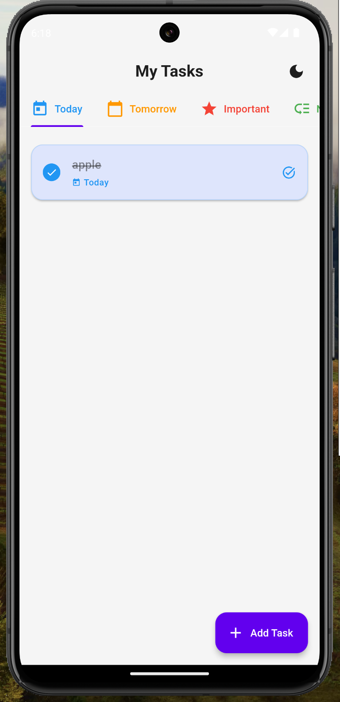

# Flutter Todo App

A modern, feature-rich Todo application built with Flutter, showcasing best practices in mobile app development.

[](https://github.com/sagarshende23/riverpod-todo-app/actions/workflows/web.yml)
[](https://github.com/sagarshende23/riverpod-todo-app/releases)

<div align="center">

### 🌐 Live Demo

<a href="https://sagarshende23.github.io/riverpod-todo-app/">
  
</a>

</div>

## 📱 Screenshots

<div align="center">
  <table>
    <tr>
      <td align="center">
        
      </td>
      <td align="center">
        
      </td>
      <td align="center">
        
      </td>
    </tr>
    <tr>
      <td align="center">
        
      </td>
      <td align="center">
        
      </td>
      <td align="center">
        
      </td>
    </tr>
  </table>
</div>

## 📥 Try the App

<div align="center">

<a href="https://sagarshende23.github.io/riverpod-todo-app/">
  
</a>

<a href="https://github.com/sagarshende23/riverpod-todo-app/releases/latest/download/app-arm64-v8a-release.apk">
  
</a>

<a href="https://github.com/sagarshende23/riverpod-todo-app/releases/latest/download/app-armeabi-v7a-release.apk">
  
</a>

<a href="https://github.com/sagarshende23/riverpod-todo-app/releases/latest/download/app-x86_64-release.apk">
  
</a>

</div>

## ✨ Features

- 📱 Clean, modern UI with Material Design 3
- 🎨 Dynamic theme support (Light/Dark mode)
- 💾 Local persistence using Hive
- 📊 Task grouping and organization
- ↩️ Undo/Redo support for actions
- ⚡ Fast and responsive animations
- 🔄 State management with Riverpod

## 🛠️ Built With

<div align="center">


</div>

## 📱 Downloads

Get the latest version of the app:

| Platform | Download |
|----------|----------|
| Android (arm64-v8a) | [Download](https://github.com/sagarshende23/riverpod-todo-app/releases/latest/download/app-arm64-v8a-release.apk) |
| Android (armeabi-v7a) | [Download](https://github.com/sagarshende23/riverpod-todo-app/releases/latest/download/app-armeabi-v7a-release.apk) |
| Android (x86_64) | [Download](https://github.com/sagarshende23/riverpod-todo-app/releases/latest/download/app-x86_64-release.apk) |
| Web | [Open Web App](https://sagarshende23.github.io/riverpod-todo-app) |

Choose the appropriate APK for your device:
- `arm64-v8a`: Most modern Android devices (64-bit)
- `armeabi-v7a`: Older Android devices (32-bit)
- `x86_64`: Android emulators and Chrome OS

## 🔧 Installation & Setup

1. Clone the repository
```bash
git clone https://github.com/sagarshende23/riverpod-todo-app.git
```

2. Get Flutter packages
```bash
flutter pub get
```

3. Run the app
```bash
flutter run
```

## 🌐 Web Deployment

This app is automatically deployed to GitHub Pages using GitHub Actions. The deployment workflow:

1. Triggers on push to main branch
2. Sets up Flutter environment
3. Enables web support
4. Builds the web app
5. Deploys to GitHub Pages

To deploy to your own GitHub Pages:

1. Fork this repository
2. Go to repository Settings > Pages
3. Set Source to "GitHub Actions"
4. Push changes to main branch
5. Check Actions tab for deployment status
6. Access your app at `https://sagarshende23.github.io/riverpod-todo-app`

## Architecture

The app follows a feature-first architecture with clean separation of concerns:

```
lib/
├── src/
│   ├── common/
│   │   ├── constants/
│   │   ├── providers/
│   │   └── theme/
│   └── features/
│       └── todo/
│           ├── domain/
│           │   └── models/
│           ├── presentation/
│           │   ├── providers/
│           │   ├── screens/
│           │   └── widgets/
└── main.dart
```

## Technologies Used

- Flutter
- Riverpod for state management
- Hive for local storage
- Material Design 3

## Getting Started

1. **Prerequisites**
   - Flutter (latest version)
   - Dart SDK
   - Android Studio / VS Code

2. **Installation**
   ```bash
   # Clone the repository
   git clone https://github.com/sagarshende23/riverpod-todo-app.git

   # Navigate to project directory
   cd riverpod-todo-app

   # Get dependencies
   flutter pub get

   # Run the app
   flutter run
   ```

3. **Build**
   ```bash
   # Generate Hive adapters
   flutter pub run build_runner build --delete-conflicting-outputs
   ```

## Dependencies

```yaml
flutter_riverpod: ^2.4.9
hive: ^2.2.3
hive_flutter: ^1.1.0
```

## Features in Detail

### Task Management
- Create, update, and delete tasks
- Mark tasks as complete/incomplete
- Group tasks by category
- Undo deleted tasks

### UI/UX
- Smooth animations
- Intuitive gestures
- Responsive design
- Error handling with user feedback

### Data Persistence
- Local storage using Hive
- Automatic state persistence
- Fast data access

## Contributing

1. Fork the repository
2. Create your feature branch (`git checkout -b feature/AmazingFeature`)
3. Commit your changes (`git commit -m 'Add some AmazingFeature'`)
4. Push to the branch (`git push origin feature/AmazingFeature`)
5. Open a Pull Request

## License

This project is licensed under the MIT License - see the LICENSE file for details.

## Acknowledgments

- Flutter team for the amazing framework
- Riverpod for state management
- Hive for local storage solution
